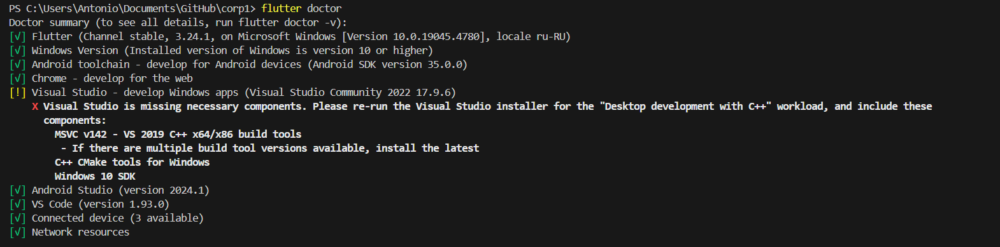
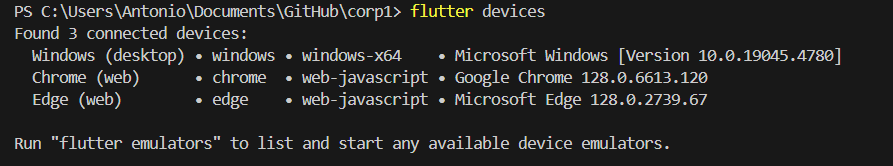
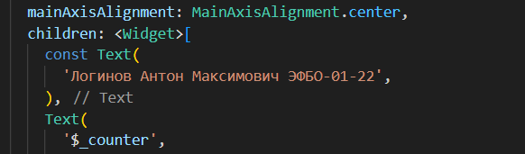
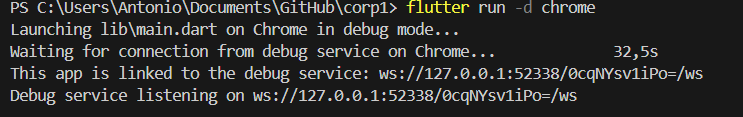
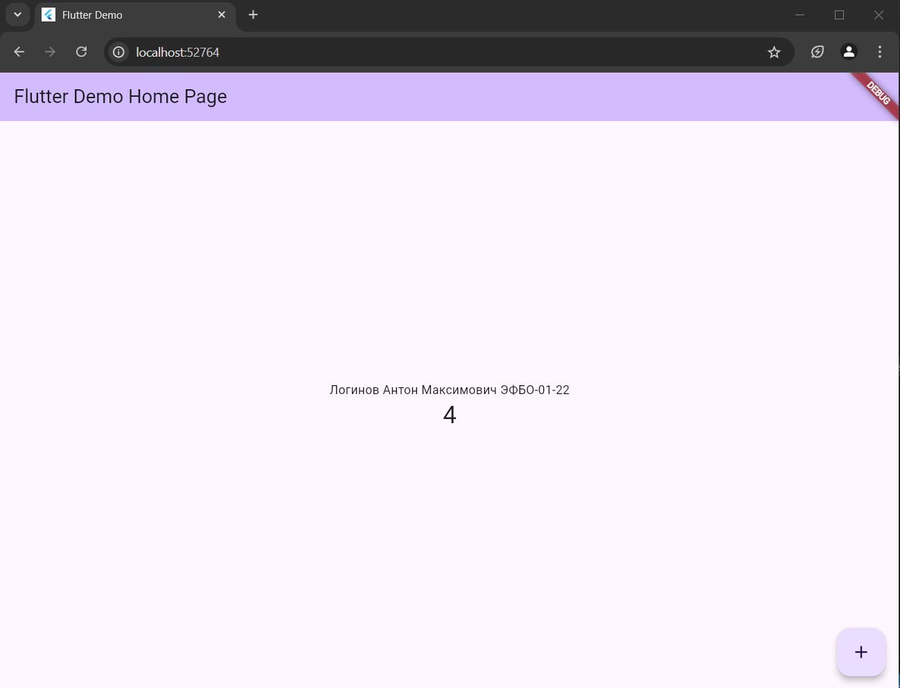

# Практическая №1 ПКС
## Логинов Антон Максимович ЭФБО-01-22
### Установка

1. Установил Android Studio и Flutter SDK

2. Добавил в переменную среды Path путь E:/flutter/bin
   
3. В терминале ввел команду `flutter doctor` и проверила, что все компоненты были установлены корректно

### Создание нового проекта

1. С помощью команды `flutter create` создал новый проект Flutter

2. C помощью команды `flutter devices` проверил, с помощью каких устройств можно запустить приложение

3. Открыл проект в Android Studio, предварительно установив плагины Dart и Flutter. 

4. В файле main.dart нашел кусок кода, который нужно изменить

### Запуск приложения

1. С помощью команды `flutter run -d chrome` запустил приложение в Google Chrome

